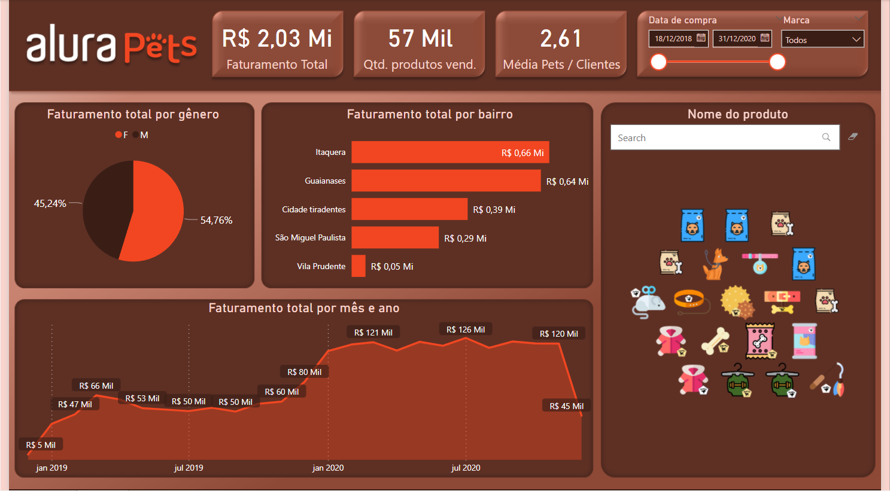
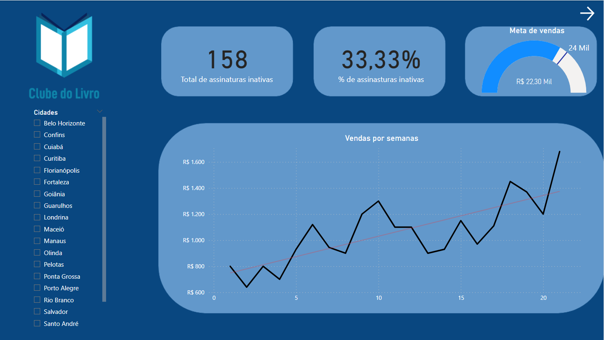
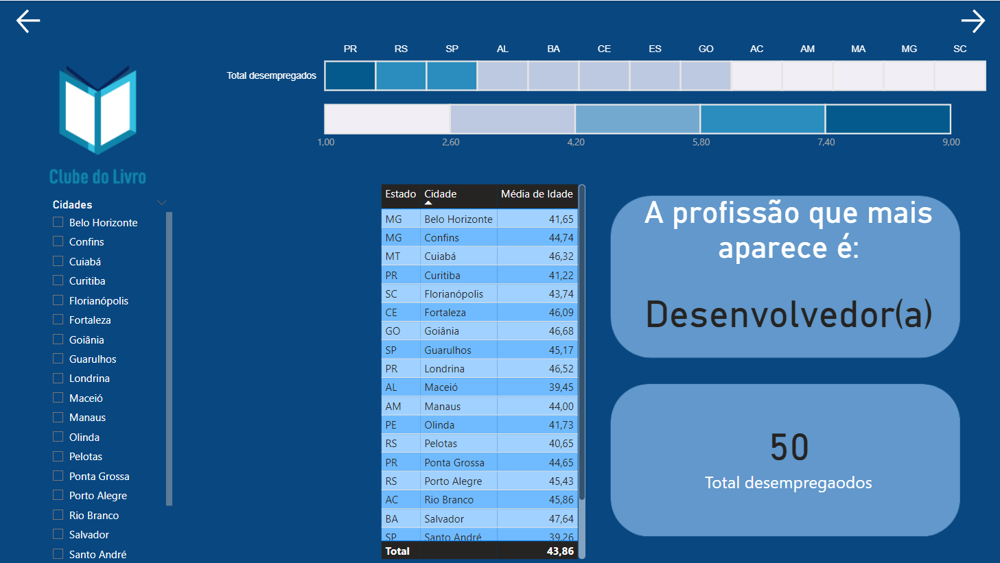
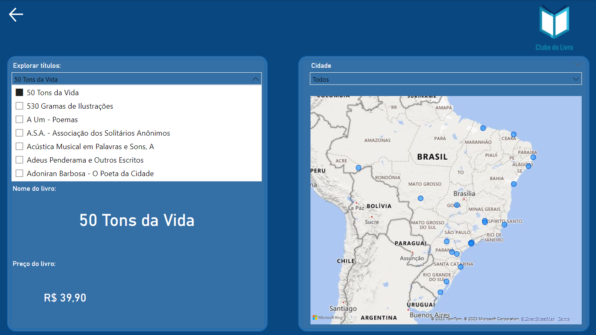
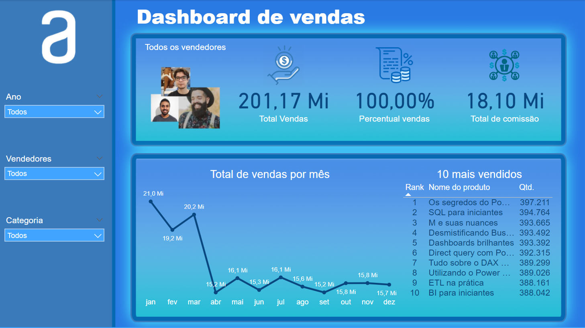
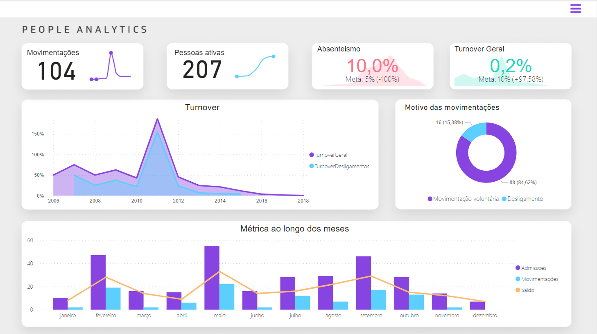

# Repositório de dashboards 

Projetos feitos nos cursos de PowerBI da [Alura](https://www.alura.com.br/).

## Alura Pets :paw_prints:
Projeto referente ao curso de [Power BI Desktop: construindo meu primeiro dashboard](https://www.alura.com.br/curso-online-power-bi-desktop-construindo-primeiro-dashboard)
### 🎯 Objetivos do projeto:
- Calcular o faturamento e visualizar esse faturamento mensalmente e anualmente;
- Filtrar para aparecer os dados de cada marca disponível na loja(Doguito e Gatito);
- Visualizar quais produtos estão disponíveis na loja e conseguir ver o faturamento de cada um desses produtos;
- Visualizar qual gênero compra mais determinado produto;
- Calcular a média de pets que cada cliente tem;
- Descobrir qual lugar tem mais clientes e tem o maior faturamento, para a abertura de uma nova loja da empresa.

---

---
## Clube do Livro :blue_book:
Projeto referente ao curso de [Dashboard com Power BI: visualizando dados](https://www.alura.com.br/curso-online-dashboard-power-bi-visualizando-dados)
### 🎯 Objetivos do Projeto:
- Utilizar na construção dos dashboards as medidas criadas, usando as fórmulas DAX, com os seguintes cálculos:
  - O total de desempregados;
  - A quantidade de assinaturas inativas;
  - A porcentagem de assinaturas inativas.
- Exibir visualmente os lucros semanais com uma linha de tendência;
- Visualizar os estados que possuem mais desempregados;
- Criar um menu, que ao selecionar um livro, mostre o nome dele e seu preço;
- Visualizar a idade média dos compradores de cada estado;
- Criar interações entre as páginas do dashboard.

--- 

---

---

---
## E-commerce Olist
Projeto referente ao curso de [Power BI: DAX contextos e iteração](https://www.alura.com.br/curso-online-power-bi-dax-contextos-iteracao)
### 🎯 Objetivos do Projeto:
- Utilizar na construção dos dashboards as medidas criadas, usando as fórmulas DAX, com os seguintes cálculos:
  - O total de comissão; 
  - O percentual das vendas;
  - A soma de vendas todas as vendas.
- Visualizar o total de vendas por mês;
- Exibir o rank com os 10 produtos mais vendidos, com a sua quantidade de vendas;
- Criar filtros de ano, categoria e de vendedores.

---

---
## Tech Safe
Projeto referente ao curso de [Power BI: explorando recursos visuais](https://cursos.alura.com.br/course/power-bi-recursos-visuais)
### 🎯 objetivos do projeto:
- Utilizar na construção dos dashboards as medidas criadas, usando as fórmulas DAX, com os seguintes cálculos:
  - A quantidade de colaboradores ativos;
  - A quantidade de desligamentos dos colaboradores da empresa ;
  - Absenteimos dos colaboradores.
- Visualizar as métricas ao longo dos meses com as admissões e movimentações;
- Exibir a quantidade de pessoas ativas e de movimentações.

---

---
### 🛠 Tecnologias

A seguinte ferramenta foi usada na construção dos projetos:
- [PowerBI](https://powerbi.microsoft.com/pt-br/desktop/)

---
## Autores

- [@JuliadBarros](https://github.com/JuliadBarros)
